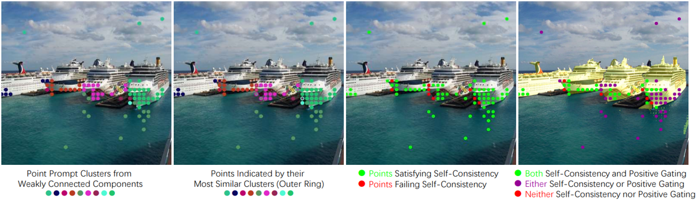
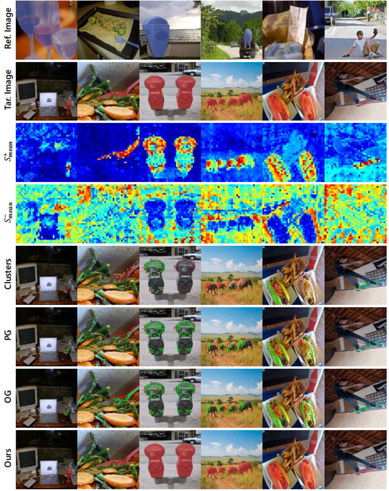
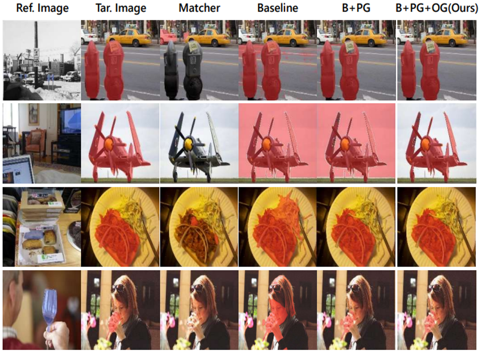
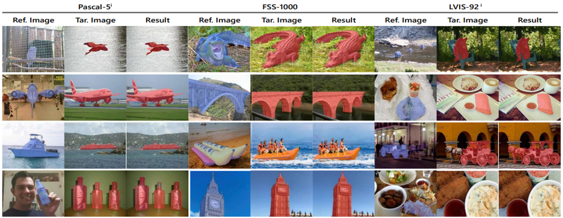
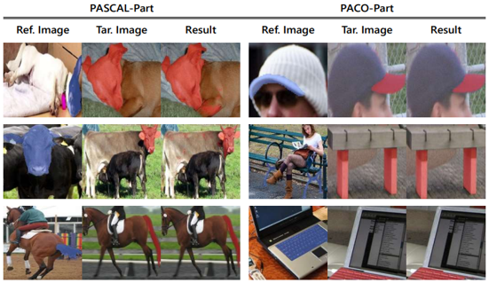
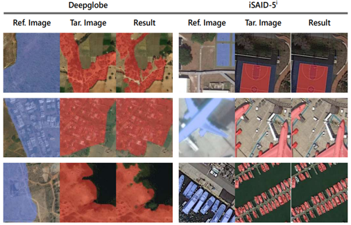

<div align="center">
<h1>[NeurIPS 2024 Spotlight✨] Official Codes for Bridge the Points: Graph-based Few-shot Segment Anything Semantically</h1>

[Anqi Zhang](https://scholar.google.com/citations?user=DmRZv5sAAAAJ)<sup>1</sup>, &nbsp; 
[Guangyu Gao](https://scholar.google.com/citations?user=snmRfqMAAAAJ)<sup>1*</sup>, &nbsp;
[Jianbo Jiao](https://mix.jianbojiao.com/)<sup>2</sup>, &nbsp;
[Chi Harold Liu](https://scholar.google.com/citations?user=3IgFTEkAAAAJ)<sup>1</sup>, &nbsp;
[Yunchao Wei](https://weiyc.github.io/)<sup>3</sup>

<sup>1</sup>School of Computer Science, Beijing Institute of Technology<br>
<sup>2</sup>The MIx group, School of Computer Science, University of Birmingham<br>
<sup>3</sup>WEI Lab, Institute of Information Science, Beijing Jiaotong University<br>

[](https://arxiv.org/abs/2410.06964)

[](https://paperswithcode.com/sota/few-shot-semantic-segmentation-on-coco-20i-1?p=bridge-the-points-graph-based-few-shot)
[](https://paperswithcode.com/sota/few-shot-semantic-segmentation-on-coco-20i-5?p=bridge-the-points-graph-based-few-shot)
[](https://paperswithcode.com/sota/few-shot-semantic-segmentation-on-pascal-5i-1?p=bridge-the-points-graph-based-few-shot)
[](https://paperswithcode.com/sota/few-shot-semantic-segmentation-on-pascal-5i-5?p=bridge-the-points-graph-based-few-shot)
[](https://paperswithcode.com/sota/few-shot-semantic-segmentation-on-fss-1000-1?p=bridge-the-points-graph-based-few-shot)
[](https://paperswithcode.com/sota/few-shot-semantic-segmentation-on-fss-1000-5?p=bridge-the-points-graph-based-few-shot)

</div>

## Overview
<div align="center">

</div>
A Graph-based approach that streamlines prompt selection, addresses mask ambiguity, improves generalization of SAM-based Few-shot Semantic Segmentation.

## Advantages

- Training-Free
- External-Hyperparameter-Free
- No iterative mask generation
- Fast inference within 2s per image (NVIDIA RTX 2080Ti)
- New state-of-the-art performance
- Effective in various domains

## Todo List

- [x] Detailed discription
- [x] Gradio Demo
- [ ] Colab Demo

## Installation

See [installation instructions](INSTALL.md).

## Getting Started

See [Preparing Datasets for GF-SAM](datasets/README.md).

See [Getting Started with GF-SAM](GETTING_STARTED.md). 

## Visualization

### Post Gating Process



### Visualization on COCO-20<sup>i</sup>




### One-shot Semantic Segmentation



### One-shot Part Segmentation



### One-shot Segmentation on Various Domains



## Citation

```
@inproceedings{zhang2024bridge,
    title={Bridge the Points: Graph-based Few-shot Segment Anything Semantically},
    author={Zhang, Anqi and Gao, Guangyu and Jiao, Jianbo and Liu, Chi Harold and Wei, Yunchao},
    journal={NeurIPS},
    year={2024}
}
```

## Acknowledgement
Our implementation is based on these repositories: [SAM](https://github.com/facebookresearch/segment-anything), [DINOv2](https://github.com/facebookresearch/dinov2), [SegGPT](https://github.com/baaivision/Painter/tree/main/SegGPT), [HSNet](https://github.com/juhongm999/hsnet), [Matcher](https://github.com/aim-uofa/Matcher), [SCCNet](https://github.com/linhanwang/SCCNet) and [detectron2](https://github.com/facebookresearch/detectron2). Thanks for their great work!